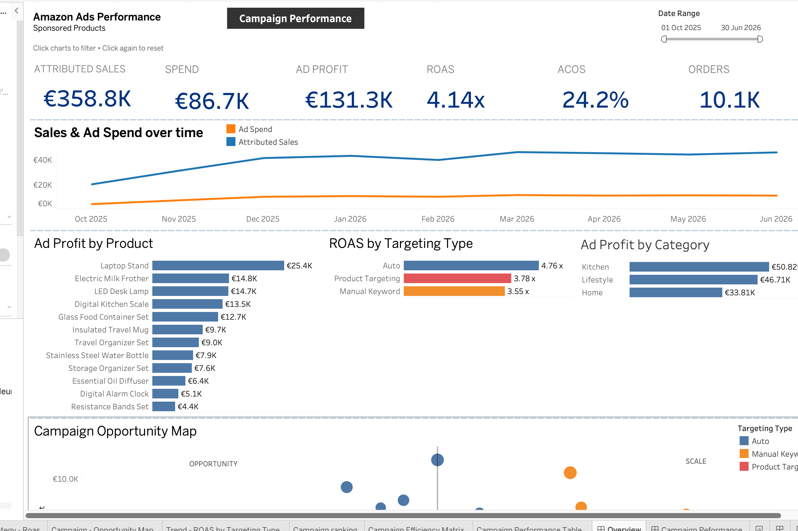
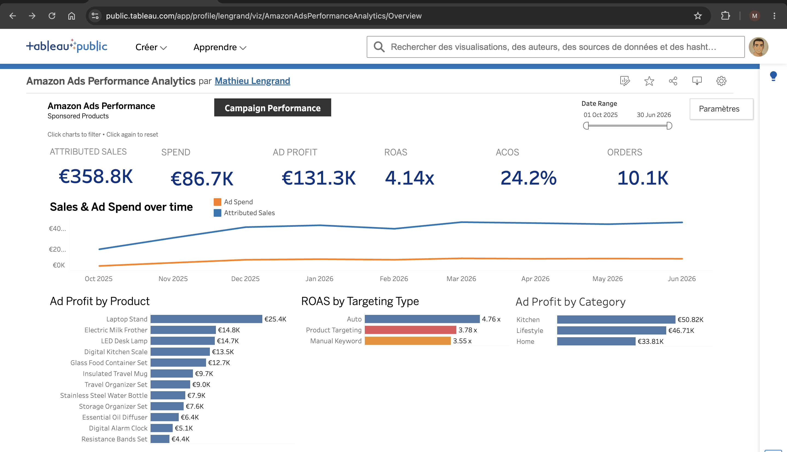

# Amazon Ads Performance Analytics

End-to-end Data Analytics portfolio project analyzing the performance and profitability of synthetic Amazon Sponsored Products campaigns for **Nexa Living**, a fictitious consumer goods brand.

The project covers the full analytics workflow: synthetic data generation, data quality controls, SQL transformation, dimensional modeling, KPI definition and interactive Tableau dashboards.

## Live Dashboard

**Tableau Public:**  
https://public.tableau.com/app/profile/lengrand/viz/AmazonAdsPerformanceAnalytics/Overview

### Executive Overview


### Campaign Performance


---

## Business Objective

Nexa Living runs multiple Amazon Sponsored Products campaigns across Home, Kitchen and Lifestyle products.

The objective is to answer a central business question:

> **How should advertising budget be allocated to maximize profitable sales?**

The analysis focuses not only on advertising revenue, but also on profitability after product costs and advertising spend.

The dashboards help identify:

- overall advertising performance
- the most profitable products and categories
- differences between targeting strategies
- high- and low-performing campaigns
- campaign efficiency through CTR, CPC and conversion rate
- opportunities to scale or optimize advertising spend

---

## Project Architecture

The project follows a layered analytical architecture:

```text
Synthetic Amazon Ads data
          │
          ▼
        RAW
          │
          ▼
      STAGING
          │
          ▼
        MART
          │
          ▼
 Analytical View
          │
          ▼
       Tableau